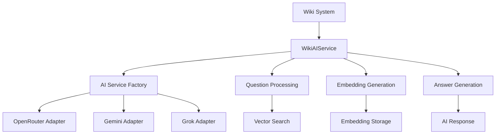
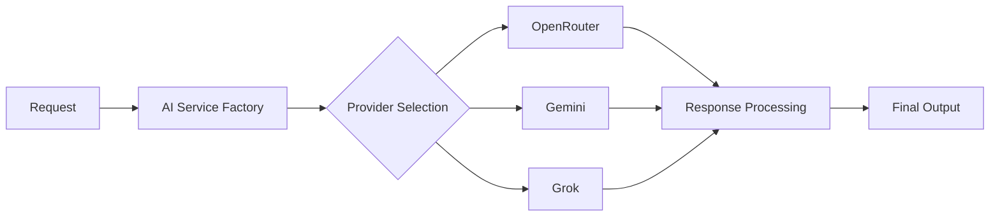
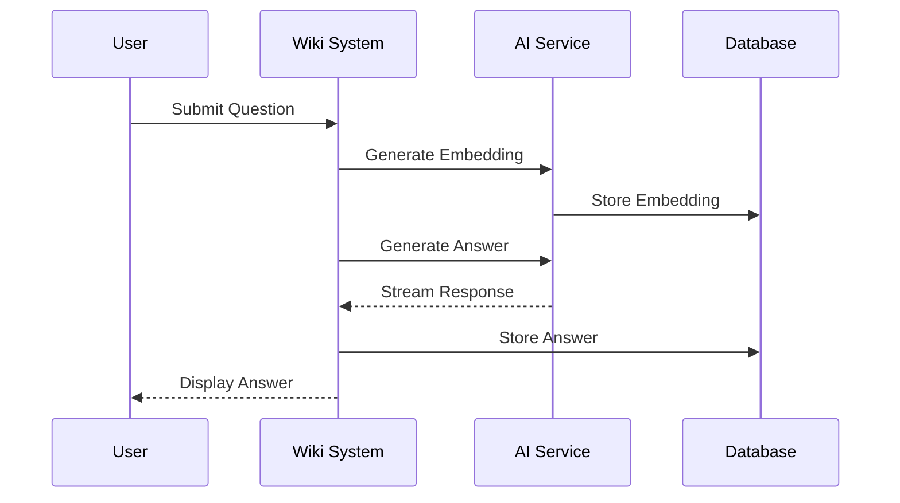

# AI and Wiki Integration Documentation

## AI Service Architecture



## AI Service Components

### 1. WikiAIService
- **Core Features**:
  - Question processing and AI answer generation
  - Vector embeddings for semantic search
  - Streaming response support
  - Fallback mechanisms for error handling

- **Key Methods**:
  ```mermaid
  classDiagram
    class WikiAIService {
      +processQuestion(WikiQuestion)
      +generateEmbedding(WikiQuestion)
      +generateAnswer(WikiQuestion)
      +generateStreamedAnswer(WikiQuestion)
      -buildQuestionPrompt(WikiQuestion)
      -getFallbackAnswer(WikiQuestion)
    }
  ```

### 2. AI Adapters System

#### OpenRouter Adapter
- **Capabilities**:
  - Multiple model support (Grok, DeepSeek, Gemini, etc.)
  - Streaming responses
  - Rate limiting and credit management
  - Vision analysis support
  
- **Models Available**:
  - Text Models:
    - Grok 2
    - DeepSeek Chat
    - Gemini 2.0
    - Mistral 3.1
  - Vision Models:
    - Grok 2 Vision

#### Provider Integration


## Wiki System Integration

### 1. Question Processing Pipeline


### 2. Vector Search Implementation
- Embedding generation for semantic search
- Storage in dedicated embedding table
- Similarity search capabilities
- Fallback to keyword search

### 3. Answer Generation Process
- Context-aware prompt building
- HTML formatting support
- Streaming response handling
- Error recovery mechanisms

## Configuration and Settings

### 1. AI Provider Settings
- Default provider selection
- Model mapping and selection
- API key management
- Rate limiting configuration

### 2. Response Formatting
- HTML output formatting
- Structured data handling
- Streaming response management
- Error handling and fallbacks

## Performance Considerations

### 1. Response Times
- Streaming for immediate feedback
- Asynchronous processing for long operations
- Caching of common responses

### 2. Resource Management
- Rate limiting implementation
- Credit usage monitoring
- Fallback strategies

### 3. Error Handling
- Graceful degradation
- Fallback content generation
- Error logging and monitoring

## Security Measures

### 1. API Security
- Secure key storage
- Rate limiting
- Request validation

### 2. Content Safety
- Input sanitization
- Output validation
- Content moderation capabilities

## Usage Examples

### 1. Basic Question Processing
```php
// Process a new question
$wikiService->processQuestion($question);

// Generate streaming response
$wikiService->generateStreamedAnswer($question);
```

### 2. Vector Search
```php
// Generate and store embedding
$wikiService->generateEmbeddingForQuestion($question);

// Search similar questions
$wikiService->searchSimilarQuestions($query);
```

## Future Enhancements

1. **Enhanced Vector Search**
   - Improved similarity algorithms
   - Multiple embedding model support
   - Hybrid search capabilities

2. **Advanced AI Integration**
   - Multi-model answer generation
   - Context-aware response formatting
   - Improved error recovery

3. **Performance Optimizations**
   - Response caching
   - Batch processing
   - Optimized embedding storage