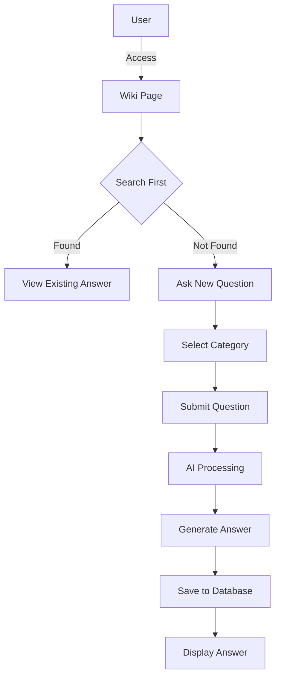
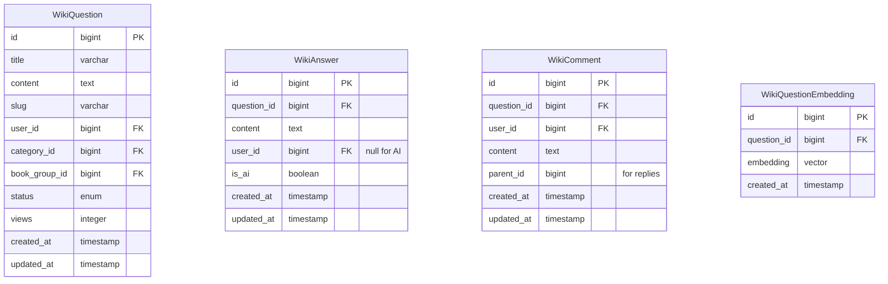
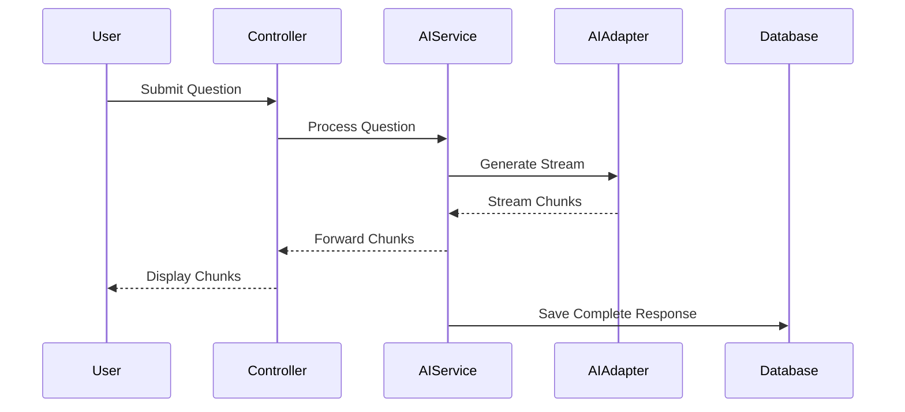

# Wiki Q&A System Implementation Plan

## System Overview



## Database Structure



## Components

### 1. Admin Configuration

#### Settings
- Default AI Provider Selection
- Vector Search Configuration
- Content Moderation Settings
- Question Categories Management

#### Database Tables
- `wiki_settings`: Global wiki configuration
- `wiki_moderation_rules`: Content moderation rules
- `wiki_provider_configs`: AI provider-specific settings

### 2. Page Layouts

#### Main Wiki Page (`/hoi-dap`)
- Three-column Responsive Layout:
  - Left Sidebar: Categories & Book Groups
  - Main Content: Search & Chat Interface
  - Right Sidebar: Active Users & Latest Questions

#### Question Detail Page
- Question Details
- AI-Generated Answer
- TinyMCE Comment Section
- Related Questions
- User Activity Section

### 3. AI Integration

#### Vector Search System
- Embeddings Generation
- Similarity Search Implementation
- Results Ranking

#### AI Streaming Architecture


## Implementation Phases

### Phase 1: Foundation
1. Database Setup
   - Create migrations
   - Set up models with relationships
   - Implement vector search tables

2. Basic Structure
   - Routes and controllers
   - Base templates and layouts
   - Admin configuration section

### Phase 2: Core Features
1. Vector Search Implementation
   - Integration with vector database
   - Similarity search algorithms
   - Results optimization

2. AI Integration
   - Streaming adapter system
   - Question processing pipeline
   - Response formatting

3. User Interface
   - Search interface
   - Chat-like question interface
   - Real-time response display

### Phase 3: Advanced Features
1. Comment System
   - TinyMCE integration
   - Real-time updates
   - Nested replies

2. Question Management
   - Moderation tools
   - Category management
   - User activity tracking

3. Related Content
   - Similar questions suggestion
   - Book group linking
   - Category relationships

## File Structure

```plaintext
app/
├── Http/Controllers/
│   ├── WikiController.php
│   ├── WikiQuestionController.php
│   └── Admin/WikiSettingsController.php
├── Models/
│   ├── WikiQuestion.php
│   ├── WikiAnswer.php
│   └── WikiComment.php
├── Services/
│   ├── WikiSearchService.php
│   └── WikiAIService.php
resources/
├── views/
│   ├── wiki/
│   │   ├── index.blade.php
│   │   ├── question.blade.php
│   │   └── partials/
│   │       ├── search.blade.php
│   │       ├── chat.blade.php
│   │       └── sidebar.blade.php
│   └── admin/wiki/
│       ├── settings.blade.php
│       └── moderation.blade.php
```

## URL Structure

### Public Routes
- `/hoi-dap` - Main wiki page
- `/hoi-dap/{category-slug}/{question-slug}` - Question detail page
- `/hoi-dap/tim-kiem` - Search results page

### Admin Routes
- `/admin/wiki/settings` - Wiki settings
- `/admin/wiki/questions` - Question management
- `/admin/wiki/moderation` - Content moderation

### API Routes
- `/api/wiki/questions/search` - Vector search endpoint
- `/api/wiki/questions/stream` - Streaming response endpoint
- `/api/wiki/comments` - Comment management

## Database Migrations

### 1. wiki_questions Table
```php
Schema::create('wiki_questions', function (Blueprint $table) {
    $table->id();
    $table->string('title');
    $table->text('content');
    $table->string('slug')->unique();
    $table->foreignId('user_id')->constrained();
    $table->foreignId('category_id')->constrained();
    $table->foreignId('book_group_id')->nullable()->constrained();
    $table->enum('status', ['pending', 'published', 'hidden']);
    $table->integer('views')->default(0);
    $table->timestamps();
});
```

### 2. wiki_answers Table
```php
Schema::create('wiki_answers', function (Blueprint $table) {
    $table->id();
    $table->foreignId('question_id')->constrained('wiki_questions');
    $table->text('content');
    $table->foreignId('user_id')->nullable()->constrained();
    $table->boolean('is_ai')->default(false);
    $table->timestamps();
});
```

### 3. wiki_comments Table
```php
Schema::create('wiki_comments', function (Blueprint $table) {
    $table->id();
    $table->foreignId('question_id')->constrained('wiki_questions');
    $table->foreignId('user_id')->constrained();
    $table->text('content');
    $table->foreignId('parent_id')->nullable();
    $table->timestamps();
});
```

### 4. wiki_question_embeddings Table
```php
Schema::create('wiki_question_embeddings', function (Blueprint $table) {
    $table->id();
    $table->foreignId('question_id')->constrained('wiki_questions');
    $table->vector('embedding', 1536); // For OpenAI embeddings
    $table->timestamps();
});
```

## Integration with Existing System

### AI Service Adaptation
1. Extend current AIService to handle streaming
2. Add vector embedding generation
3. Implement question classification

### User Interface Integration
1. Use existing TinyMCE component
2. Adapt current layout system
3. Integrate with authentication

### Search System Implementation
1. Vector database setup
2. Similarity search implementation
3. Results ranking and filtering

## Security Considerations

1. Rate Limiting
   - Question submission limits
   - Search query limits
   - Comment posting limits

2. Content Validation
   - Question content sanitization
   - Comment moderation
   - File upload restrictions

3. Access Control
   - User role verification
   - Category access control
   - Admin feature protection

## Performance Optimization

1. Caching Strategy
   - Question cache
   - Vector search results cache
   - User activity cache

2. Database Optimization
   - Indexing strategy
   - Query optimization
   - Relation eager loading

3. UI/UX Performance
   - Lazy loading
   - Progressive enhancement
   - Asset optimization

## Testing Strategy

1. Unit Tests
   - AI service methods
   - Vector search functions
   - Model methods

2. Integration Tests
   - API endpoints
   - Search functionality
   - Comment system

3. E2E Tests
   - Question submission flow
   - Search and navigation
   - Admin features