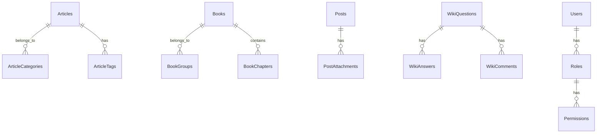

# Educational CMS Project Overview

## System Architecture

```mermaid
graph TD
    A[Client Browser] --> B[Laravel Application]
    B --> C[Content Management]
    B --> D[User Management]
    B --> E[AI Services]
    B --> F[Search Services]
    
    C --> C1[Articles]
    C --> C2[Books]
    C --> C3[Posts]
    C --> C4[Wiki]
    
    E --> E1[OpenRouter]
    E --> E2[Gemini]
    E --> E3[Grok]
    
    F --> F1[Multi-Search]
    F --> F2[Content Search]
</graph>
```

## Core Components

### 1. Content Management
- **Articles**: Educational content with categories and tags
- **Books**: Structured educational materials organized in groups and chapters
- **Posts**: General content entries with attachment support
- **Wiki**: Interactive Q&A system with community features

### 2. AI Integration
- Multiple provider support (OpenRouter, Gemini, Grok)
- Content generation with Vietnamese language optimization
- Smart formatting and response processing
- Vision analysis capabilities

### 3. Search System
- Multi-model search functionality
- Advanced query building
- Custom result transformers for different content types
- Relationship-aware searching

### 4. User System
- Role-based access control
- Permission management
- Admin and guest role separation
- User authentication and verification

### 5. SEO & Performance
- Dynamic SEO metadata generation
- Sitemap management
- Content caching
- Optimized database queries

## Database Structure



## Key Features

### Content Management
- Rich text editing
- Media handling
- Content versioning
- Attachment management

### AI Integration
- Smart content generation
- Image analysis
- Content optimization
- Multi-provider support

### Search & Discovery
- Full-text search
- Faceted search
- Related content suggestions
- Custom search transformers

### Administration
- User management
- Content moderation
- System settings
- Analytics and reporting

## Technical Stack

### Backend
- Laravel PHP Framework
- MySQL Database
- Redis Cache (optional)
- Queue System for AI Jobs

### Frontend
- Blade Templates
- TinyMCE Editor
- Tailwind CSS
- Custom JavaScript

### External Services
- AI Providers (OpenRouter, Gemini, Grok)
- File Storage
- Caching Layer
- Search Engine

## Security

- Role-based access control
- Input validation
- CSRF protection
- XSS prevention
- Rate limiting

## Performance Optimization

- Database indexing
- Content caching
- Lazy loading
- Queue management
- Asset optimization