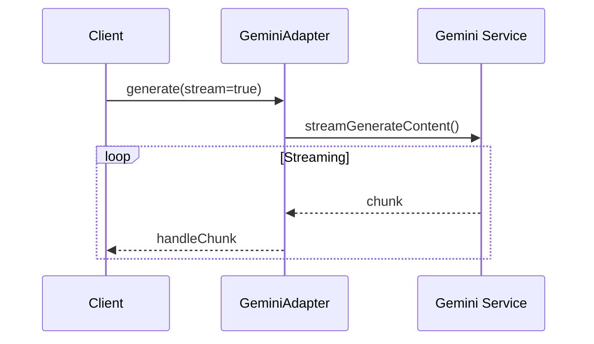
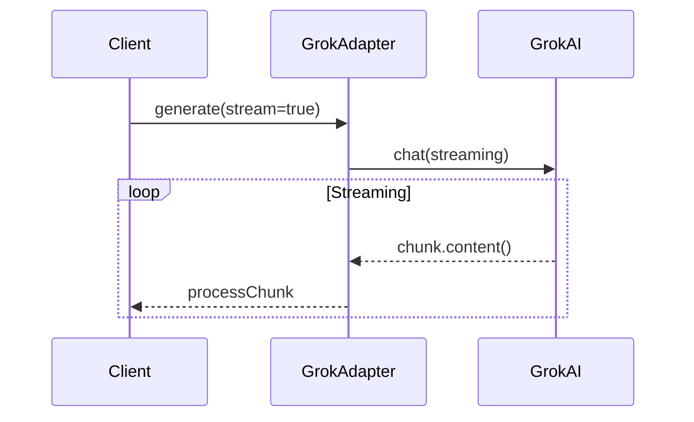
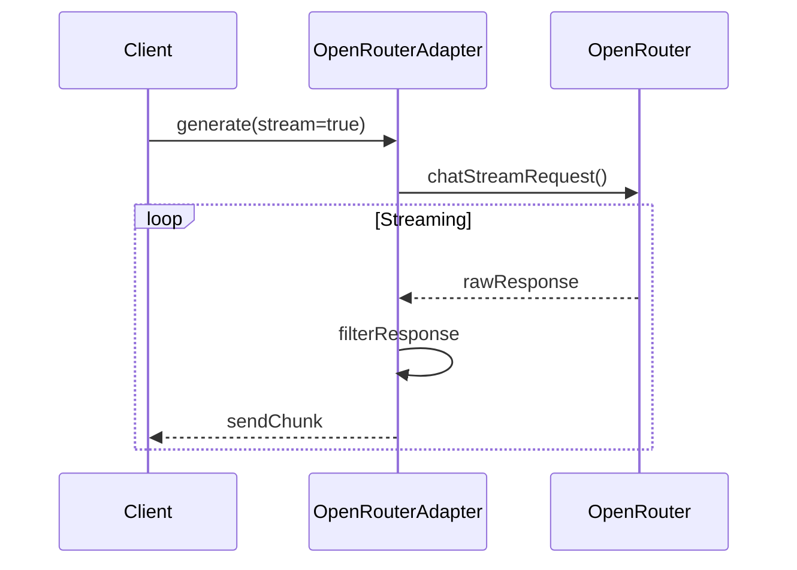
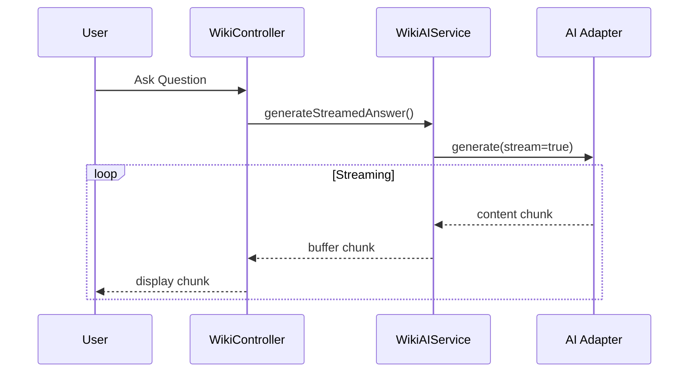

# Streaming Implementation Overview

## Key Features

### 1. Consistent Streaming Interface
- All adapters support both callback and direct output streaming
- Common options structure across all providers:
  ```php
  $options = [
    'stream' => true,
    'stream_callback' => callable,
    'flush_output' => true
  ];
  ```

### 2. Provider-Specific Implementations

#### Gemini Adapter


#### Grok Adapter


#### OpenRouter Adapter


## Error Handling

### Common Pattern
```php
try {
    // Stream setup
    if ($options['stream'] ?? false) {
        $streamCallback = $options['stream_callback'] ?? null;
        
        if ($streamCallback) {
            // Use callback
            $streamCallback($chunk);
        } elseif ($options['flush_output']) {
            // Direct output
            echo $chunk;
            ob_flush();
            flush();
        }
    }
} catch (\Exception $e) {
    Log::error('Streaming error', [
        'error' => $e->getMessage(),
        'trace' => $e->getTraceAsString()
    ]);
    throw $e;
}
```

## Integration with Wiki System

### WikiAIService Streaming


### Response Format
- All streaming responses maintain a consistent format:
```php
[
    'choices' => [
        [
            'message' => [
                'content' => $content
            ]
        ]
    ],
    'usage' => [
        'prompt_tokens' => -1,
        'completion_tokens' => -1,
        'total_tokens' => -1
    ]
]
```

## Usage Examples

### Basic Streaming
```php
$service->generate($model, $prompt, [
    'stream' => true,
    'flush_output' => true
]);
```

### With Callback
```php
$service->generate($model, $prompt, [
    'stream' => true,
    'stream_callback' => function($chunk) {
        // Process chunk
    }
]);
```

### Wiki Integration
```php
$wikiService->generateStreamedAnswer($question);
```

## Best Practices

1. **Error Handling**
   - Always use try-catch blocks for streaming operations
   - Provide fallback content when streaming fails
   - Log errors with detailed context

2. **Buffer Management**
   - Use ob_flush() and flush() for direct output
   - Clear output buffer when using callbacks
   - Handle connection drops gracefully

3. **Resource Management**
   - Close streams properly after use
   - Monitor memory usage during streaming
   - Implement timeouts for long-running streams

4. **Testing**
   - Test both streaming modes (callback and direct)
   - Verify error handling and fallbacks
   - Simulate slow connections and drops

## Limitations and Considerations

1. **Provider Differences**
   - Each provider has different token limits
   - Streaming implementation details vary
   - Error formats may differ

2. **Performance**
   - Memory usage increases with stream length
   - Network stability affects streaming quality
   - Buffer size affects chunk delivery

3. **Security**
   - Validate stream content before output
   - Handle sensitive information properly
   - Monitor for malicious content